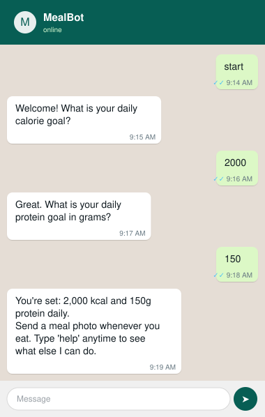
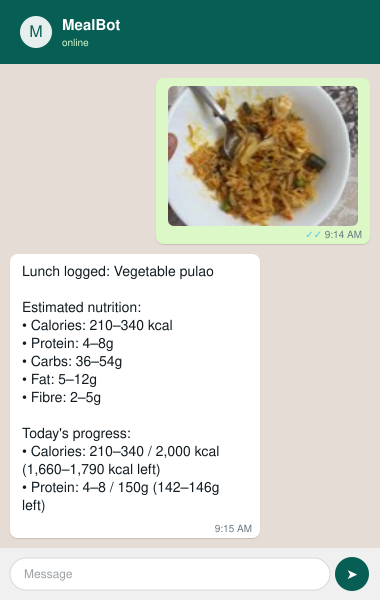
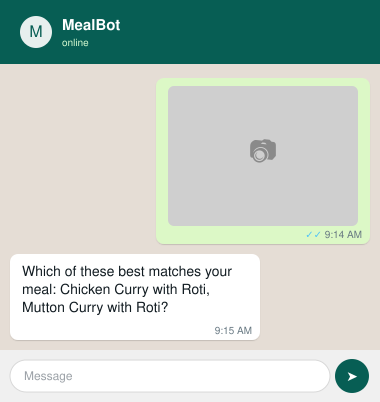

# MealBot

A WhatsApp bot (via Twilio) that lets you send a photo of a meal, uses Gemini
to estimate its nutrition, and tracks your daily calorie/protein progress
against goals set during onboarding.

Backend is a single FastAPI app backed by SQLite.

## Demo

These are recreated chat mockups, not live phone screenshots. Each one shows
the bot's real reply text — generated by actually running the code, not
written by hand. The onboarding, nutrition estimate, and `today` summary
replies all came from a real run (including a real Gemini call on a sample
meal photo). The one exception is the clarifying question: since that only
happens when Gemini itself judges a photo as ambiguous, that example was
produced by feeding the same real reply logic a realistic "ambiguous photo"
input instead of waiting to get a genuinely uncertain one from the model.

| Onboarding | Auto-logged meal |
|---|---|
|  |  |

| Clarifying question | `today` summary |
|---|---|
|  |  |

The clarifying-question case is the most distinctive part of the design: rather than
always trusting the model's nutrition estimate, [`decision_policy.py`](decision_policy.py)
only auto-logs when the model is confident about both the dish and the portion size —
otherwise it asks instead of guessing.

## How it works

1. Text the bot on WhatsApp to onboard: set a daily calorie goal and a daily
   protein goal.
2. Send a photo of a meal. Gemini analyzes it and estimates calories,
   protein, carbs, fat, and fibre — always as a range, not a point value,
   since a photo can't give exact numbers.
3. If the estimate is trustworthy enough (unambiguous dish, confident
   portion size), it's logged automatically and you get a reply with your
   remaining calories/protein for the day. If not, the bot asks a
   clarifying question (e.g. which dish, or how large the serving was)
   instead of guessing.
4. Text `today` any time for a summary of what you've logged, `undo` to
   remove the last meal, or `help` for the full command list.

## Setup

Activate the virtualenv (`.venv` already exists) and install dependencies:

```bash
source .venv/bin/activate
pip install -r requirements.txt
```

Create a `.env` file (not committed) with:

| Variable | Required | Purpose |
|---|---|---|
| `TWILIO_ACCOUNT_SID` | yes | Twilio account credentials |
| `TWILIO_AUTH_TOKEN` | yes | Twilio account credentials |
| `TWILIO_WHATSAPP_FROM` | yes | Sender number used for reminders |
| `GEMINI_API_KEY` | yes | Gemini API key for nutrition analysis |
| `PUBLIC_BASE_URL` | no | Public HTTPS origin, used to reconstruct the exact URL Twilio signed when validating webhook requests. Without it, signature validation falls back to the request's own URL, which is wrong behind most proxies. |
| `TWILIO_VALIDATE_SIGNATURE` | no | Defaults to `"true"`. Set to `"false"` for local dev where there's no real Twilio-signed request (e.g. plain curl). |

## Running

Start the dev server (webhook lives at `POST /whatsapp`, health check at
`GET /health`):

```bash
uvicorn main:app --reload
```

Point a Twilio WhatsApp sandbox (or a configured WhatsApp sender) at
`<PUBLIC_BASE_URL>/whatsapp`.

## Testing

```bash
pytest
```

Run a single test file or test:

```bash
pytest tests/test_decision_policy.py
pytest tests/test_decision_policy.py::test_name -v
```

To manually exercise the Gemini nutrition analysis against a saved image in
`uploads/` (edit the path in the script first):

```bash
python run_nutrition_manual.py
```

## Eval harness

`eval/` is a local, manually-run harness for objectively comparing prompt or
model changes to `nutrition.py`, instead of eyeballing
`run_nutrition_manual.py` output. It's not wired into CI — real Gemini calls
cost money and are non-deterministic (see `eval/run_eval.py`'s docstring).

```bash
python -m eval.run_eval                                   # run against the current prompt/model
python -m eval.run_eval --save eval/results/baseline.json # save a named baseline
python -m eval.run_eval --compare-to eval/results/baseline.json  # diff against it
python -m eval.run_eval --model gemini-2.5-flash           # A/B a different model
python -m eval.run_eval --prompt-file candidate_prompt.txt # A/B a different prompt
```

To add a real golden case: drop an image in `eval/golden/images/` and add an
entry to `eval/golden/cases.json` with your own verified expected
ranges/decision.

## Architecture

See [CLAUDE.md](CLAUDE.md) for a full walkthrough of the request flow,
module responsibilities, and data model. Briefly:

- [main.py](main.py) — app/lifespan wiring, Twilio signature validation, and
  the `/whatsapp` route's dispatch logic.
- [conversation.py](conversation.py) — onboarding state machine.
- [commands.py](commands.py) — text commands (`help`, `today`, `undo`,
  reminders on/off) and clarification resume flow.
- [analysis_job.py](analysis_job.py) — background task that calls Gemini and
  applies the decision policy.
- [nutrition.py](nutrition.py) — Gemini prompt and response schema.
- [decision_policy.py](decision_policy.py) — decides whether to trust a
  nutrition estimate enough to auto-log it, or ask a clarifying question.
- [daily_progress.py](daily_progress.py) — daily nutrition totals and
  progress formatting.
- [storage.py](storage.py) — downloads and saves inbound meal images.
- [messaging.py](messaging.py) — audited outbound Twilio sends.
- [reminders.py](reminders.py) — scheduled meal-time reminder loops.
- [models.py](models.py) / [database.py](database.py) — SQLAlchemy models
  and SQLite session setup.

## Deployment

Not currently deployed — run locally per the instructions above. The app is
designed to run as a single always-on process (FastAPI + SQLite on local/
persistent disk), which rules out scale-to-zero serverless hosts: the meal
reminders in [reminders.py](reminders.py) are `asyncio` loops that need the
process to stay alive continuously. [render.yaml](render.yaml) is kept as an
example of one hosting configuration that satisfies this (a single Render
web service with a persistent disk mounted for the SQLite database and
uploaded images), not as a live deployment.
